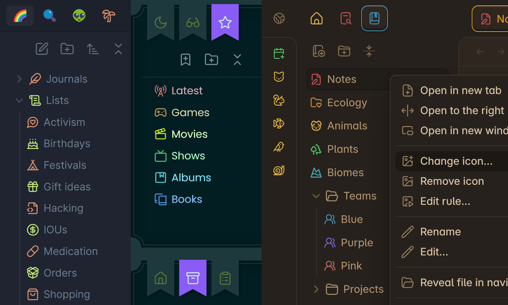
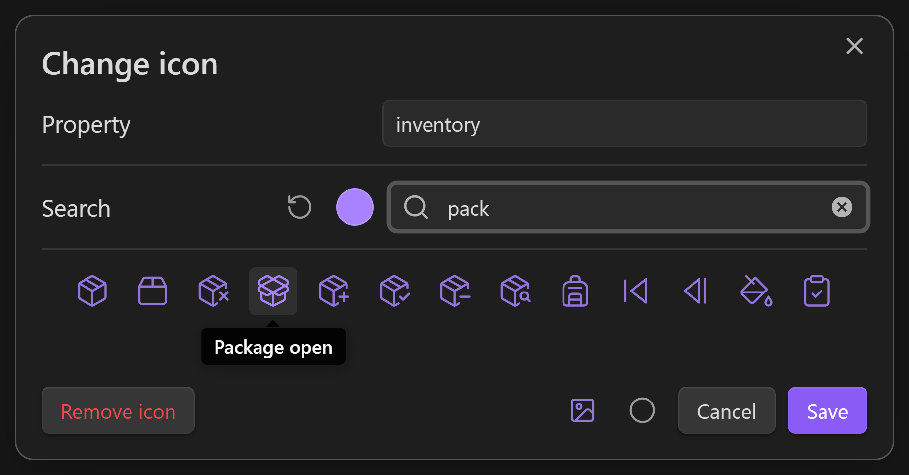
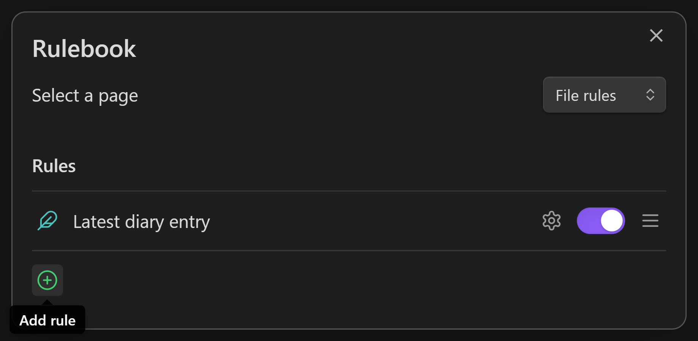
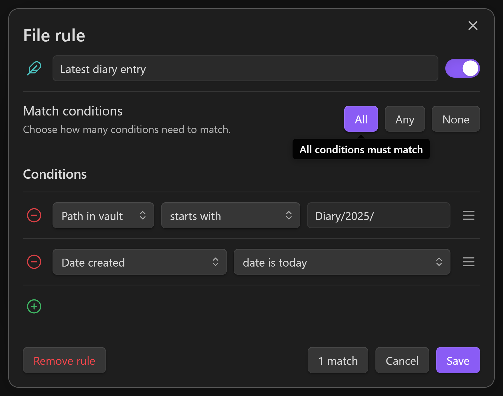

# Iconic (Custom)

> **Private customized fork** of [gfxholo/iconic](https://github.com/gfxholo/iconic). Starting at v0.0.1.

A plugin for iconophiles, designed to blend seamlessly with vanilla Obsidian.

**New in this fork:** Expanded icon support beyond Lucide + Emojis, including:

- [Simple Icons](https://simpleicons.org/) (brand/product logos)
- [Devicons](https://devicon.dev/) (technology & dev tool logos)

Click almost any icon on a tab, sidebar, ribbon, or the title bar to swap in one of the 1,700+ [Lucide icons](https://lucide.dev/) included in the app, or one of the 1,900+ [emojis](https://www.unicode.org/emoji/charts/full-emoji-list.html) that your device supports.

> ⤿ Themes: [Ayu Light & Mirage](https://github.com/taronull/ayu-obsidian) / [Fancy-a-Story](https://github.com/ElsaTam/obsidian-fancy-a-story) / [Primary](https://github.com/primary-theme/obsidian)

Includes language support for English, Arabic, German, Spanish, French, Indonesian, Japanese, Russian, Ukrainian, and Simplified Chinese. Most of these languages are currently machine-translated, but if you can supply more accurate translations, absolutely send a message or a pull request :)

## Custom Icon Libraries (this fork)

This version adds support for additional icon libraries:

- **Simple Icons** — Popular brand and product logos
- **Devicons** — Popular technology logos (programming languages, frameworks, tools, cloud providers, etc.)

Icon IDs for new libraries are registered using Obsidian's icon system, so they work everywhere Lucide icons do (including rules and colorization).

> Note: This is an early private development version (0.0.1). Icon sets will be expanded iteratively.

## Supported items

- Tabs 📑
- Files & Folders 📝📂
- Bookmarks & Groups 🔖📂
- Tags 🏷️
- Properties 📦
- Ribbon commands 🎀
- Minimize/Maximize/Close buttons 🪟
- Sidebar toggles ◀️▶️
- Help/Settings buttons ❔⚙️
- Pin buttons (on tablets) 📌

## How to use

### Changing an icon

Secondary-click an item whose icon you want to change, then click `Change icon` from the menu. You can open menus on mobile by pressing & holding an item. Certain lists like Files, Bookmarks, and Properties let you hold <kbd>Alt</kbd> or <kbd>⇧ Shift</kbd> to select multiple items at once.

Every icon is searchable by name. You can filter between icons and/or emojis by clicking the bottom two toggles. When you find an icon that sings for you, click it to confirm.

You can also choose one of nine optional colors per icon. These colors follow the CSS theme of your vault, so they adjust automatically when it changes. If you prefer a specific RGB color, secondary-click the bubble to open the full color picker.

The icon picker will also display a warning if a rule in your rulebook is overruling its icon. To learn about that feature, see below.

### Setting up rules

You can set up a rulebook to automate your file & folder icons based on a variety of conditions, like their name, their extension, their parent folder, their tags, their property values, the date you've created or modified them, and even the current time of day. Automated icons never remove your custom icons — only replace them visually — so you can be as experimental as you want.

Open the rulebook from the ribbon, from the plugin settings, or by using the `Open rulebook` command. There are currently two pages in the rulebook: `File rules` and `Folder rules`, which affect files and folders respectively.

Click the green (+) to add a new rule, or right-click an existing rule to see more actions.

Every rule has a name, and an icon, which will overrule the icon of anything that it matches. You can enable and disable a rule using its toggle. Rules at the top of the list have the highest priority, so drag them around as needed!

### Editing a rule

To start editing a rule, click the ⚙️ beside it.

You can edit the rule's conditions in this window. A condition is a true or false test — it either matches, or it doesn't, and you can add any number of conditions to a rule. Rules interpret their conditions based on their `All` / `Any` / `None` setting. For example, if you want a rule to match when *any* of its conditions match, click the `Any` button. You can always see what your rule is matching by clicking the `Matches` button at the bottom.

When you're using Obsidian, if your rule is overruling an icon, you can secondary-click that icon and choose `Edit rule` to return to this window quickly.

There are several types of conditions you can add to a rule:

- `Icon` checks the icon set to a file/folder
- `Color` checks the color set to a file/folder
- `Name` checks the simple name of a `File`/`Folder`
- `Filename` checks the full name of a `File.md`
- `Extension` checks the file extension, like `md`, `canvas`, `jpg`, etc.
- `Folder tree` checks the initial `Path/Leading/To/Your/` file
- `Path in vault` checks the entire `Path/Leading/To/Your/File.md`
- `Headings` checks for `# Headings` inside a note
- `Links` checks for `[[Links]]` inside a note
- `Embeds` checks for `![[Embeds]]` inside a note
- `Tags` checks for tags inside a note, including `#hashtags` and the `tags` property
- `Properties...` checks the value of a specific property inside a note
- `Date created` checks the date & time a file was created
- `Date modified` checks the date & time a file was modified
- `System clock` checks the date & time on your device

Date & time conditions are checked once every minute, so you can use them to modify your icons in real time.

## What makes this plugin different from [Iconize](https://github.com/FlorianWoelki/obsidian-iconize)?

Iconic and Iconize can both change the icons & colors of files & folders, and automate icons based on their filepath. But Iconic can also:

- Change icons by clicking them directly
- Change icons & colors from the same dialog
- Dynamically shift colors to match your theme
- Automate icons using a conditional rule system
- Change icons of plugin tabs, tags, properties, ribbon commands, and window buttons

### Can I use both plugins together?

Sort of, just expect a few visual bugs! They currently do some fighting over control of tab icons and the Bookmarks pane.

## License

This plugin is released under an [MIT No Attribution](https://choosealicense.com/licenses/mit-0/) license (same as the original), which means you're free to modify and share its source code without crediting the authors of this repository. It also protects those authors from liability for damages, so I recommend using a similar license if you republish this code.

## Attribution & Fork Notice

- Original Iconic plugin: [gfxholo/iconic](https://github.com/gfxholo/iconic) by Holo
- This is a private customized fork by Christian Lempa focused on additional icon libraries (Simple Icons and Devicons).
- Not intended for public release at this time.

## Installing this private version

1. Use [BRAT](https://github.com/TfTHacker/obsidian42-brat) (recommended for private repos):
   - Add beta plugin: `ChristianLempa/obsidian-iconic-custom`
   - Or specify the `main` branch.
2. Or manually:
   - Build with `npm run build`
   - Copy `main.js`, `manifest.json`, and `styles.css` to your vault's `.obsidian/plugins/iconic-custom/`
   - Enable the plugin (ID will be `iconic-custom` so it can coexist with the official Iconic).

> The plugin ID is `iconic-custom` to allow testing alongside the official community plugin.
